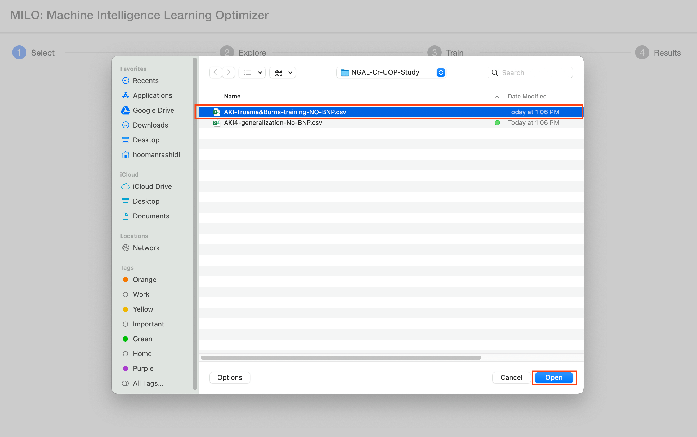
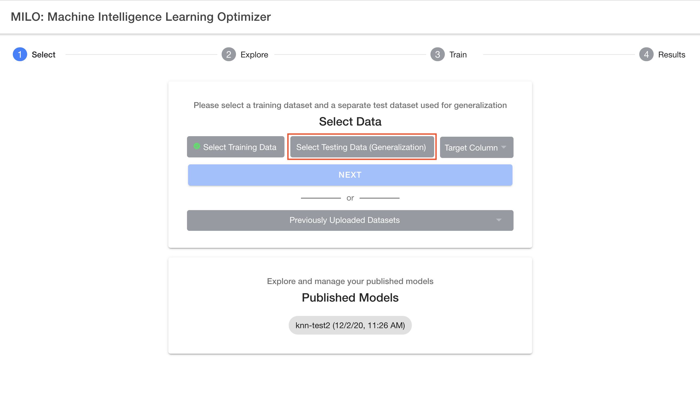
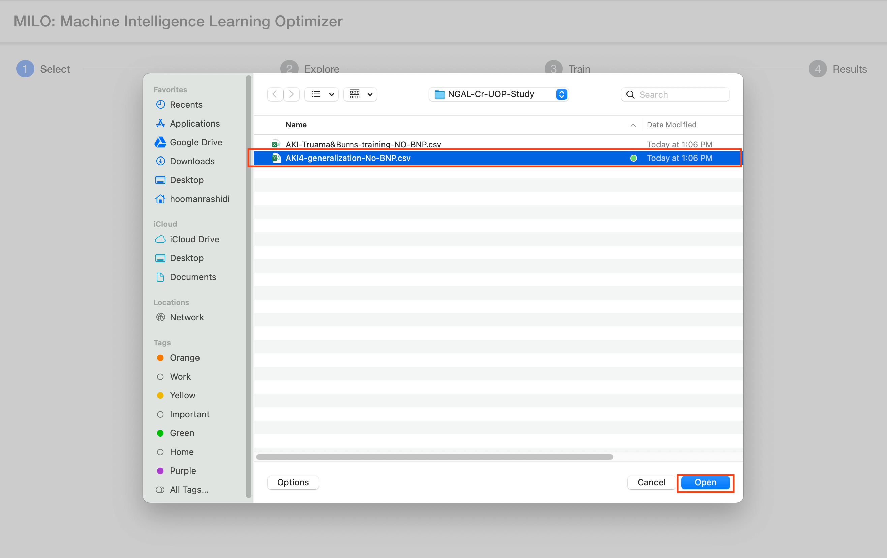
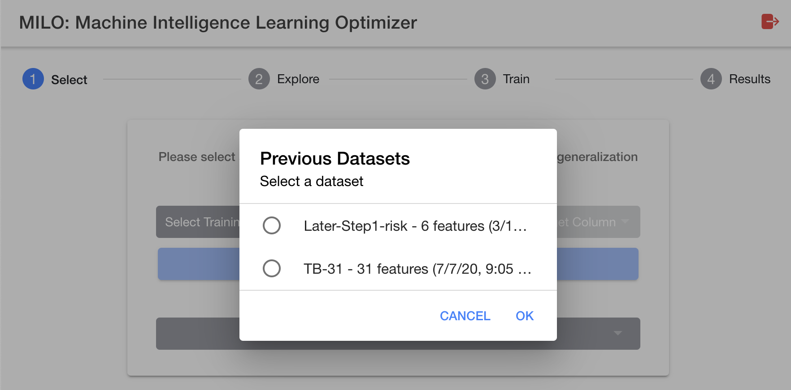

# Step 1: "Select" (Selecting & Uploading your datasets)

Now that you are ready to import your two compatible datasets in MILO-ML, the next several sections will take you step by step through MILO-ML’s simple 4 step approach which ultimately will give rise to your ML model(s).

As noted earlier, first comes the "Select" step which allows you to easily upload your 2 required datasets followed by you picking your binary target of interest (e.g., "Cancer" as shown in the sample dataset provided). Hence, in this first step of the 4-step process, you select and upload the 2 required datasets ("Training-Cancer.csv" and "Generalization-Test-set-Cancer.csv"), similar to what is being shown below within MILO-ML’s "1-Select" page. If this is your first-time using MILO-ML, please use these datasets as you follow along the remainder of this guide. Note: the files listed in the image may have a different label as the files you are uploading but the concept is the same.

After selecting your two csv datasets, you will then need to select your target column name (e.g., "Cancer" if using the sample datasets provided) which needs to be a binary target (i.e., 0s representing your negative cases and 1s for your positive cases). For more details on this subject, please see the "Defining the model target" section above.

## Select previously uploaded dataset

The previous section was focused on how to upload your "new" datasets (not previously uploaded in MILO-ML) within the platform. This section specifically deals with previously uploaded datasets within MILO-ML. If you have previously uploaded a dataset, you do not need to upload it again for additional searches. You may select these prior uploaded datasets by clicking the "Previously Uploaded Datasets" button on the MILO-ML homepage as shown in the image below.

After clicking the "Previously Uploaded Datasets" button (located under the "Next" button), you will be presented with a window to select the prior dataset of your choosing (see image below).

Now that you have uploaded the two required datasets within MILO-ML and have selected the appropriate binary target (e.g. Cancer, etc.), you are now ready to click the "Next" button and move to the "2-Explore" page which allows you to get a better sense of what has been ingested into MILO-ML before any of the ML steps have been initiated.

## Evaluation of data completeness

When exporting data in bulk, often times you will find gaps for some rows in various columns and those values may be represented in various ways. Gaps can be blank, NaN, Null, or other representations. Notably, MILO-ML will remove such rows which do not contain 100% of the column’s numerical data. The number of rows removed versus used will be visible after uploading the dataset and discussed in a later chapter. Obviously, for datasets with increased number of missing data, MILO-ML’s removal of the rows with missing data could sometimes markedly limit the final number of usable data within MILO-ML. This can sometimes alter the results in light of the much smaller dataset created and used within MILO-ML. To minimize the number of rows (i.e., cases) removed by MILO-ML’s automated approach, we recommend the user to first self-evaluate the datasets to minimize the removal of such rows/cases. This can sometimes be easily achieved by removing certain columns (instead of rows) that appear to be missing a great deal of the data. Hence, removal of such columns (when deemed appropriate by the user) can markedly minimize the removal of rows/cases by MILO-ML and allow for a greater number of cases to be evaluated by MILO-ML’s automated platform with minimal impact on the final dataset size.

::: warning
Some datasets may have other invalid values such as numerical representations (e.g. -1 instead of 1, when the user did not intend to use a negative value, etc.) and these cases will not be removed by MILO-ML and must be handled prior to upload.
:::
