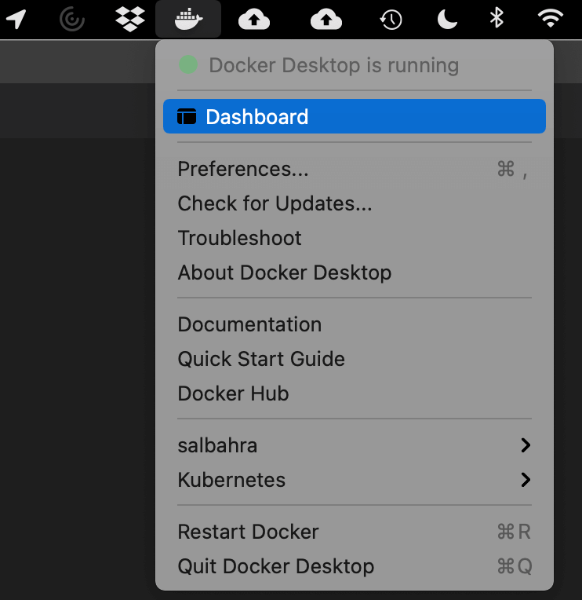
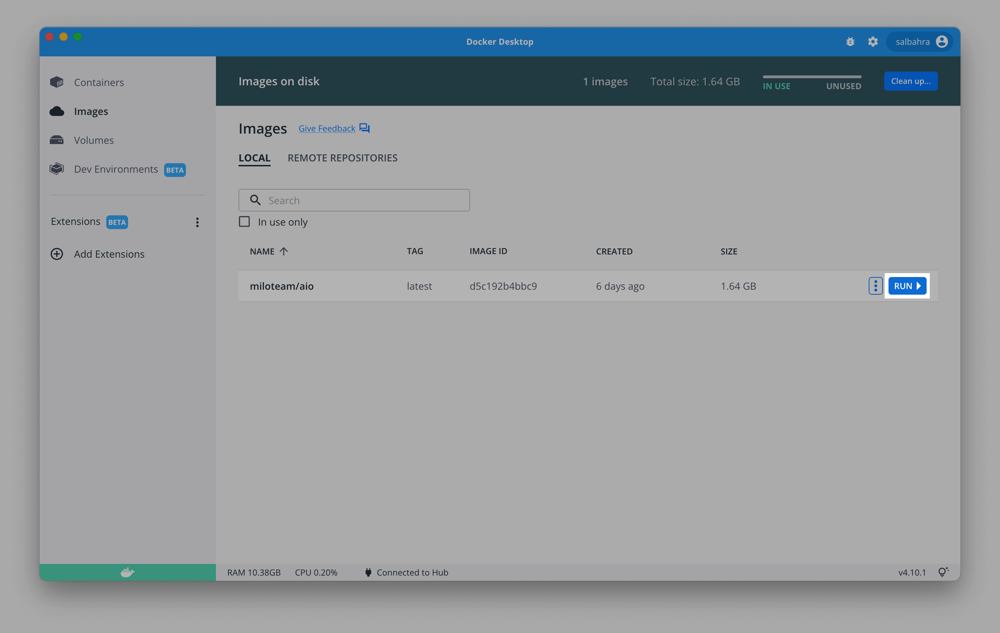
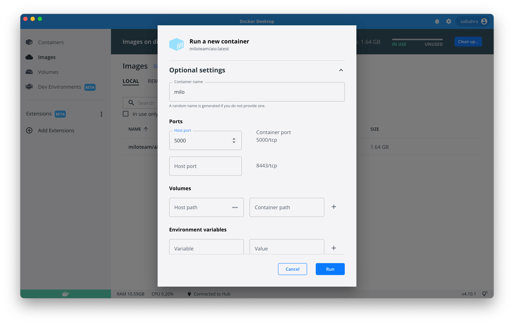

# Docker

MILO's docker image hosts everything needed to get up and running with MILO.

## Download Image

Please contact us to get a download link to our docker image. The file downloaded by the link provided will be a TAR file which should not need to be extracted.

## Import Image

Docker Desktop does not currently provide a way to import an image but fortunately also installs Docker CLI. In this section, we will use Docker CLI
to import the MILO docker image.

Please open any terminal and run the following command:

```sh
# Replace the file name with the one you downloaded

docker load -i milo-1.0.0.tar
```

## Starting MILO

Once the MILO image is loaded, the remainder of the deployment can be performed within Docker Desktop.

To start this image first open the Docker Desktop Dashboard as shown here:



With the Dashboard open, navigate to the `Images` section:


You will see an image named `milo`. If you hover over this two buttons will appear one of which is labeled `Run` as shown here:



After clicking this button you will be presented with a modal with some optional settings. Please expand this section
and configure it as shown in the image below:



The port 5000 is HTTP application port and is being forwarded to the host machine's port 5000 in the above image. The data
directory is where MILO places input data and results and can be mapped to the local machine for consistency between runs.

::: warning
License keys are associated to the hardware and therefore will become invalidated as the hardware changes. Keep in mind, each time
the `Run` button is clicked Docker creates new virtual hardware.
:::
