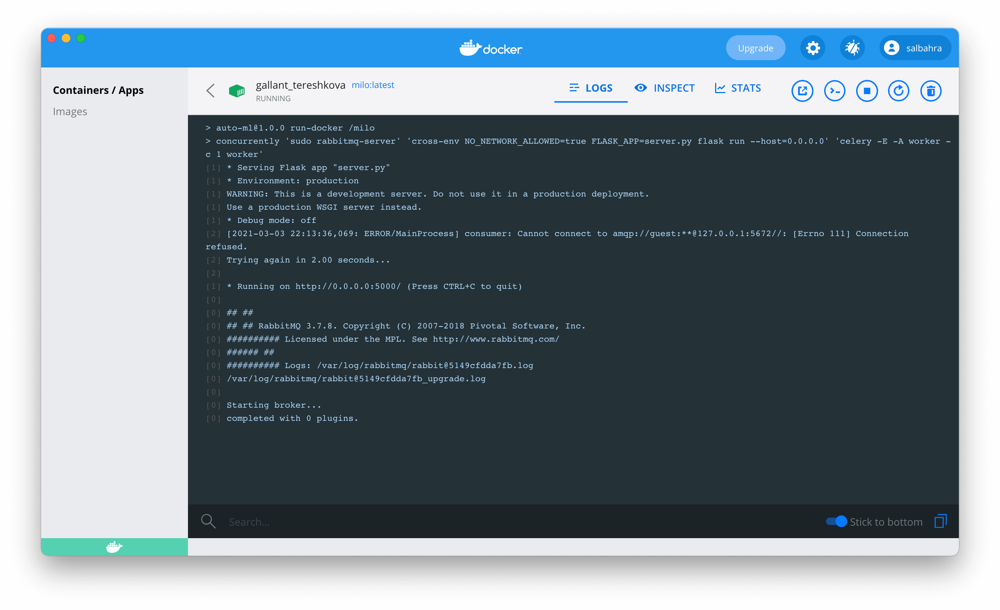

# Docker

MILO-ML's docker image hosts everything needed to get up and running with MILO-ML.

## 1) Install Docker Desktop

Download [Docker Desktop](https://www.docker.com/products/docker-desktop) and follow the instructions from the installer to get it installed on your system.

## 2) Open Docker Dashboard and Configuring Docker

This is a one time step after installing Docker to ensure enough resources are allocated for MILO-ML. This is done using the Docker Desktop Dashboard launched as shown here:


Inside the dashboard click the button with a gear icon as shown:


This will navigate to a settings page which has sections on the left hand side. Please navigate to the `Resources` section as shown below:


Here, please adjust the settings to maximize the available CPU and memory to meet at least 4 CPUs and at least 8GB of RAM.

## 3) Download MILO-ML Image

Please contact us to get a download link to our docker image. The file downloaded by the link provided will be a TAR file which should not need to be extracted.

## 4) Import MILO-ML Image

Docker Desktop does not currently provide a way to import an image but fortunately also installs Docker CLI. In this section, we will use Docker CLI
to import the MILO-ML docker image.

Please open any terminal and run the following command:

```sh
# Replace the file name with the one you downloaded

docker load -i milo-1.0.0.tar
```

## 5) First Time Starting MILO-ML

Once the MILO-ML image is loaded, the remainder of the deployment can be performed within Docker Desktop.

To start this image first open the Docker Desktop Dashboard and navigate to the `Images` section:


You will see an image named `milo`. If you hover over this two buttons will appear one of which is labeled `Run` as shown here:


After clicking this button you will be presented with a modal with some optional settings. Please expand this section
and configure it as shown in the image below:


The port 5000 is HTTP application port and is being forwarded to the host machine's port 5000 in the above image. The data
directory is where MILO-ML places input data and results and can be mapped to the local machine for consistency between runs.

::: warning
License keys are associated to the hardware and therefore will become invalidated as the hardware changes. Keep in mind, each time
the `Run` button is clicked Docker creates new virtual hardware.
:::

## 6) Start Using MILO-ML

After you start MILO-ML, you should see some output similar to the following:



This informs you that MILO-ML is ready to start processing requests and you can now launch your browser and navigating
to the following URL: <http://127.0.0.1:5000>.

## Stopping MILO-ML

You can always stop and re-start MILO-ML using the Dashboard by clicking the `Stop` button as shown below:


::: warning
Stopping MILO-ML will interrupt any training currently in progress so ensure no tasks are pending before stopping.
:::

Once stopped, the button will change to a play button allowing you to start MILO-ML again.
