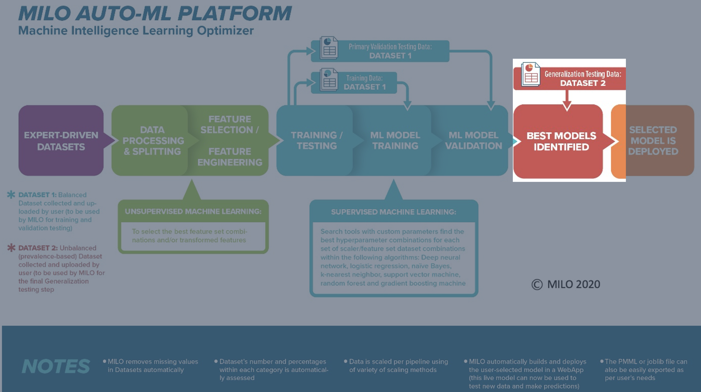
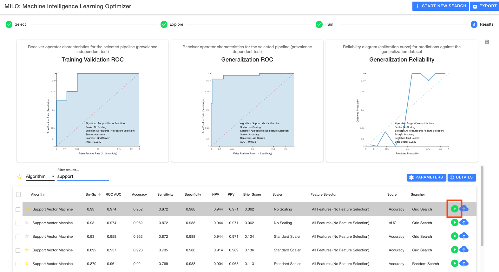

# Step 4: "Results"

This page allows one to visualize the model performances (based on their Generalization dataset assessment) and to fine-tune or deploy the models if needed.

Once a run is completed, you will automatically be taken to this results page (see below). Here you can view all pipelines run and their statistical performance against your generalization dataset.

## Overview

In the image below you will see 3 graphs at the top and a table below them. The graphs represent details for the selected model (highlighted in grey) within the table. As you select new models, the graphs will update with their corresponding models and their associated performance measures.

## Table options

The table itself is very flexible and offers many options. First, on the left-hand side, you will notice a star which allows you to mark models as favorites. You may also use the header bar star to toggle showing only favorites.

Next is the table filter which allows you to drill down on results in a variety of ways. Using the `All` drop down, you can filter on all aspects of a run whereas selecting specific options from the drop down ensure the filter only applies to that aspect of the model.

You may also tap on any header element to sort the table using that field. The header button can be tapped again to change the sort from descending to ascending.

## Export results

Next to the graphs, you will see a save icon (highlighted with the red box in the image below) which allows you to export PNGs of all three graphs for the model that has been selected within the table (highlighted in grey within the table).

Additionally, there is an export button (highlighted with the red box in the image below) at the top header which allows a CSV export of the entire table of results for viewing in any spreadsheet editor (e.g., Excel). This highlights the transparency of the MILO-ML platform and will not only allow you to further explore the models and their results but will also allow one to independently verify the MILO-ML results (if you choose to do so).

:::tip
For details on the exported report, please refer to [Glossary for Report Column Definitions](./glossary-report-export.md)
:::

## Run details

In order to see details about the MILO-ML run (e.g., how many models were built and evaluated, how many pipelines and what combination was employed, etc.), you may select one of the two blue buttons located in the middle right side (between the table and the graphs). The first button, `Parameters` allows you to see which pipeline elements were selected during step 3 (i.e., Train step). The second button, `Details` (highlighted with the red box in the image below) gives you some basic information about the number of models built within each algorithm along with what was ingested within the MILO-ML run, as shown below.

## Test model

Each row of a model will have a green play button indicating the ability to run the model for ad hoc testing. Please see the [Test model](./test-model.md) documentation for more detail.

## Publish model

Each row of a model will also have a blue upload button (highlighted by the red box in the image below) indicating the ability to fix and publish the model for current or future use without the need for new or additional training.

Once the model of interest is selected (grey highlighted row in the table as shown above), the blue cloud button can be clicked (as highlighted by the red box in the image above) to name and ultimately publish this model on your MILO-ML homepage. You will first be presented with a new window to name your model (no spaces allowed in naming the new model) and if desired, change the default decision threshold (leave empty to use the default value of .5) as shown below.

Please see the [Publish model](./publish-model.md) documentation for more detail.
